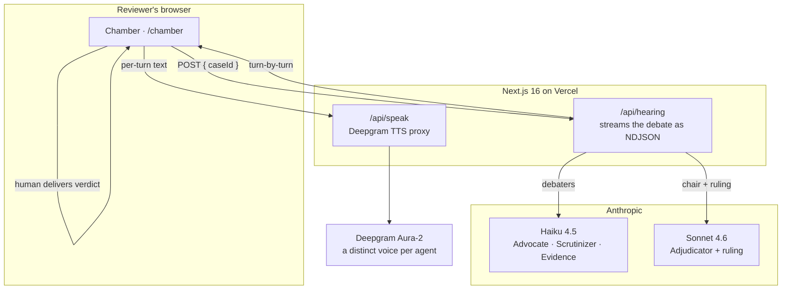
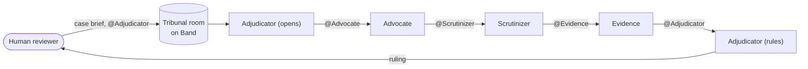

<div align="center">

# ⚖️ Juro

### Both sides heard. One ruling.

An adversarial AI tribunal for denied health-insurance claims. Four agents argue a denial in one shared room on **Band**, a human delivers the binding ruling, and every line is hash-chained so the record can't be quietly changed.

[**Live demo →**](https://juro-roan.vercel.app) · [The Chamber →](https://juro-roan.vercel.app/chamber)

`Band of Agents Hackathon` · `Track 3 — Regulated & High-Stakes Workflows` · `MIT`

</div>

---

## The problem

In the US, about **one in five** in-network health claims is denied, and **fewer than one in a hundred** is ever appealed. It isn't only here: roughly one in nine health claims is rejected in India, and two thirds of UK disability denials are overturned once a judge actually looks. The denials usually don't win because the law is against the patient. They win because nobody builds the case.

Juro builds it.

## What it does

When a claim is denied, four specialized agents take it to a tribunal in one shared room:

| Agent | Role |
|---|---|
| **Advocate** | Argues for the patient, marshalling the records and policy language that support coverage. |
| **Scrutinizer** | Argues the insurer's side, probing for missing documentation, exclusions, and step-therapy gaps. |
| **Evidence** | Stays neutral and produces the exact document or statute that settles a disputed fact. |
| **Adjudicator** | Chairs the hearing and recommends a ruling, then hands the decision to a human. |

They read and rebut each other instead of passing tasks down a line. A person reads the whole debate and delivers the binding decision, and Juro drafts the appeal letter with the citations already in it. The AI argues. A human rules.

## Architecture

Two paths produce the same thing, a **transcript**, and the front end plays it. The Chamber streams a live debate; the Band runtime runs the same four roles as separate agents in one shared room.

### The live Chamber (what the demo shows)



### The Band tribunal (the multi-agent runtime)



Each agent is its own process that connects to Band over a WebSocket and joins one shared room. They argue by `@mentioning` each other, which is the part that needs Band: real multi-agent coordination, not a hub handing out work.

## What makes it hold up

Getting four independent models to run a clean debate was the hard part. Three things make it reliable and trustworthy:

- **A cross-model panel.** The three debaters run on a fast model (`claude-haiku-4-5`); the chair runs on a heavier one (`claude-sonnet-4-6`), because weighing both sides and writing the ruling carries the most reasoning.
- **A deterministic relay.** A mention-driven debate stalls when a model hands off to the wrong agent, and goes silent when a model returns its ruling as plain text without posting. Juro's custom LangGraph adapter forces every handoff in code (the chain can't stall) and posts the model's final text itself if the send tool was skipped (no turn is ever lost).
- **A tamper-evident record.** Every turn is hash-chained into a single root. Change one word, anywhere, and the root no longer matches.

## Tech stack

| Layer | What |
|---|---|
| Front end | Next.js 16 (App Router), React 19, Tailwind v4, Framer Motion, Lenis |
| Agents | Python, `band-sdk` (Band), LangGraph, Anthropic Claude (Haiku 4.5 + Sonnet 4.6) |
| Voice | Deepgram Aura-2 (a distinct voice per agent) |
| Deploy | Vercel |

## Repository

```
web/                      Next.js app — the landing and the Chamber
  src/app/
    page.tsx              the landing ("Court Record")
    chamber/page.tsx      the reviewer console (live hearing)
    api/hearing/route.ts  streams the live cross-model debate
    api/speak/route.ts    Deepgram TTS proxy (per-agent voices)
  src/components/         Chamber, HearingTranscript, landing, motion
  src/lib/                Transcript schema, the live-hearing player, roles, voice
  src/data/               the bundled sample cases

backend/                  Python
  src/juro/
    roles.py              the four role prompts + the Band relay protocol
    agents/               the Band agent processes (advocate, scrutinizer, …)
    band_runner.py        register agents, submit a case, export the transcript
    band_api.py           thin async wrappers over Band's REST API
    generate.py           run the debate locally (Anthropic only)
    transcript.py         the transcript model + the hash chain
```

## Getting started

### The web app

```bash
cd web
npm install
npm run dev          # http://localhost:3000
```

The Chamber's live hearings and the agent voices need two keys in `web/.env.local`:

```
ANTHROPIC_API_KEY=sk-ant-...     # the agents' reasoning
DEEPGRAM_API_KEY=...             # the agent voices
```

The app ships with a bundled sample hearing, so a fresh clone runs without keys.

### The Band tribunal

```bash
cd backend
pip install -e .

# the Band SDK pins a private submodule, so install it from a no-submodule clone:
git clone --depth 1 https://github.com/thenvoi/thenvoi-sdk-python.git /tmp/band-sdk
pip install "/tmp/band-sdk[langgraph,anthropic]"

# put your Band user key + Anthropic key in backend/.env, then:
python -m juro.band_runner setup          # register the four agents on Band
python -m juro.agents.advocate            # start each agent (own process); they
python -m juro.agents.scrutinizer         #   connect over WebSocket and wait to
python -m juro.agents.evidence            #   be @mentioned
python -m juro.agents.adjudicator
python -m juro.band_runner brief mri-erisa  # print a case brief to paste into a room
```

Create a room in the Band web app, add the four agents, paste the brief, and `@mention` the Adjudicator. The agents argue; you reply `OVERTURN` or `UPHOLD`.

## Grounded in real law

Every ruling cites its authority. The cases are built on real statute: ERISA's full-and-fair-review right (`29 C.F.R. § 2560.503-1`), the ACA's binding external review (`45 C.F.R. § 147.136`), *Jimmo v. Sebelius*, the ACR Appropriateness Criteria, and the No Surprises Act.

## License

MIT. See [LICENSE](LICENSE).
